## Rules
**Value** "5"  
**Clue** "Read the Rules. Under stand the Rules. Follow the Rules.""  
**Hint** ""  
**Flag** "BTC{c6d18f3d857bda2f41e605d6ca81c80c}"  

1. Navigate to the [Last Minute CTF](http://44.201.80.76/) dashboard and then to the **Rules** section. 
2. The flag can be found on this page by expanding certain sections of text.

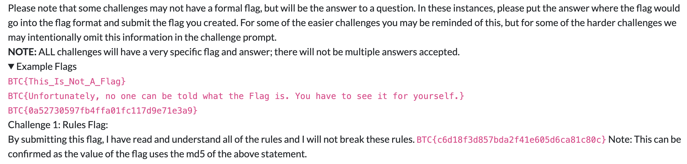

## Writeups
**Value** "5"  
**Clue** "Learn about Challenge Writeups and Challenge Guides."  
**Hint** ""  
**Flag** "BTC{B0nusP01ntsM4keM3H4ppy--}"  

1. Navigate to the [Last Minute CTF](http://44.201.80.76/) dashboard and then to the **Writeups** section. 
2. Reading through the page, there is an *Example Writeup* section that includes instructions for this challenge.

3. View the sourcecode of the writeups.htm page which includes the flag as directed.  The process to do this may vary depending on the web browser being used.

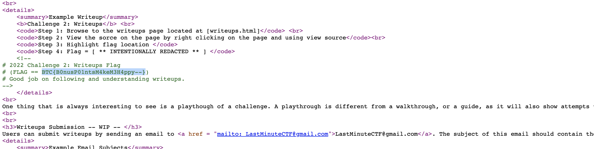

## Not for Humans
**Value** "10"  
**Clue** "Having completed your introductory tour of our CTF, we invite you to explore a little more to find two additional flags that have been hidden on our site. The first is hidden in a place not designed for humans..."   
**Hint** ""  
**Flag** "BTC{1fY0uC4nR34dTh1sY0u'r3@N3rd=}"  

1. Based on the clue given, it is likely that the reference points to a robots.txt file which is used to control which resources in a web page are crawled by various search engines. 
2. From the CTF page, navigate to http://44.201.80.76/robots.txt where the flag is presented in cleartext.

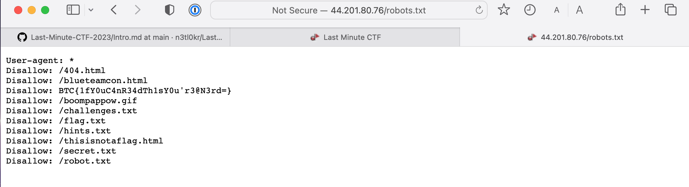

## Legends of the Hidden Flag  
**Value** "10"  
**Clue** "Tales tell of a hidden flag somewhere on the scoreboard. You may need to dig around to find it."  
**Hint** ""  
**Flag** "BTC{Th3-nois3-th4t-blu3-mak3s.}"  

So, during a previous challenge, I noted that the robots.txt file in the root of the CTF server contained multiple bologna entries.  

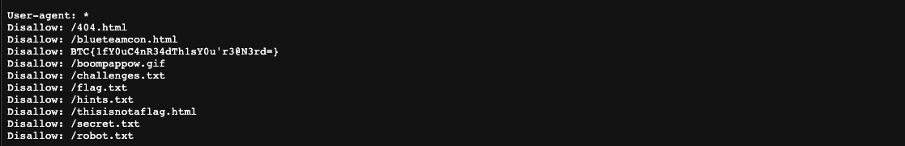

One of these in particular caught my attention amid an ocean of easter eggs. 

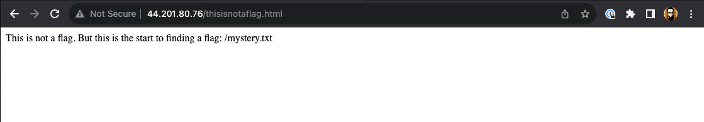

This file mentions another file that is not listed in the robots digest which tells me that there may be other hidden files as well.  However, navigating to the next hop here leads to another riddle so to say. 

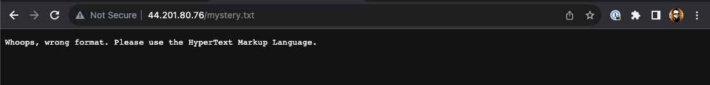

Now we try to navigate to `../mystery.html` and poof, all of the sudden I'm looking at Chapter 1 of Alice In Wonderland, how cute. 

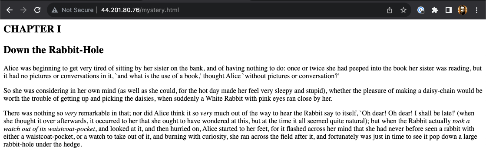

At the bottom of this page I find another hyperlink, this time a `mystery2.html` page. I have to admin that I'm slightly intrigued at this point. 

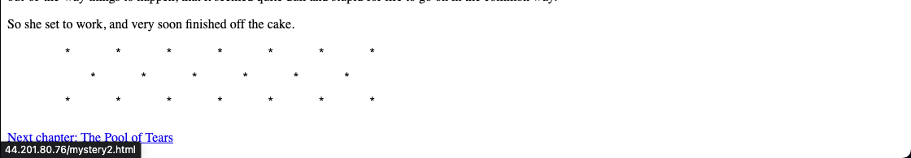

Alright, proof of chapter 2!  But wait, theres another chapter at the bottom of the page but this is no hyperlink. 

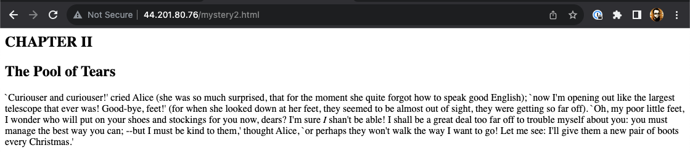

After inspecting the source of the page, I find a malformed comment containing a reference to another html page. `caucus-race.html`

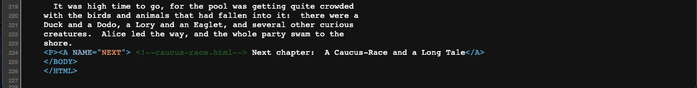

This next chapter looks a little more strange with a long list of reference links.  However, only one of them appear to be functional (`../aliceIV.html`). 

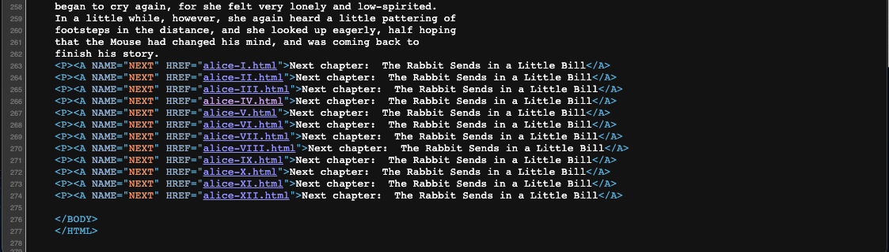

The next page appears broken as well so taking the clue from the source code, we add a roman numeral to the URL. (`../Chapter(#).html` to `../ChapterVI.html`.  

Moving along, this page contains a link for another `html` page, however the page link is missing a '.' before `html`.  Fixing that takes us to yet another page. `(../mad-tea-party.html)`

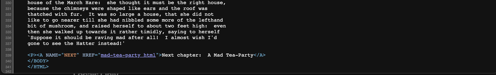

And another trick! Lets check out `view-source.txt`!

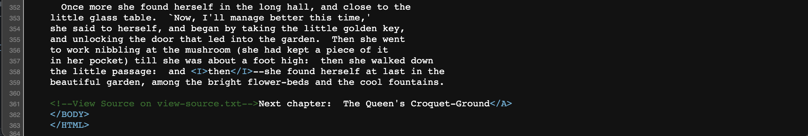

From here, we are faced with another broken hyperlink.  This time, `turtle.html` seems to do the trick.

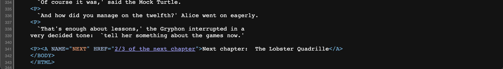

As you can see below, things are really getting wild now.  

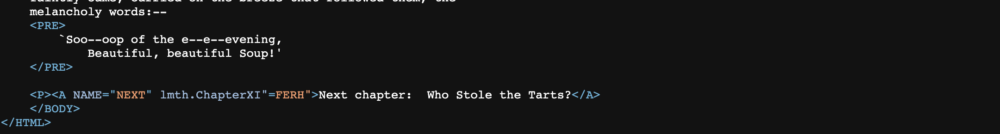

This appears to be a clue, 2/3 of the next chapter.  "The Lobster" or "Lobster Quadrille" are the first things that come to mind, lets check it out!  `LobsterQuadrille.html` works!  Lets go!

Now looking at the bottom of the Lobster page, we have another crafty little trick.  This type, there appears to be a hyperlink written backwards! `lmth.ChapterXI"=FERH"` should read `HREF="IXretpahC.html"`

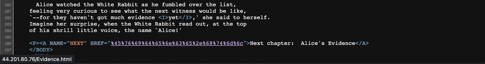

And now some URL encoded nonsense!  But a quick mouseover shows the actual link. `../Evidence.html`

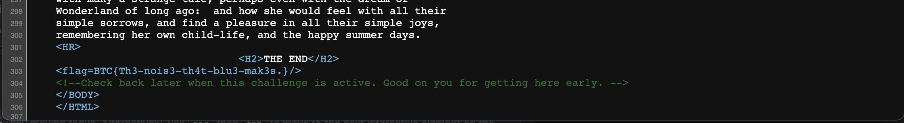

It looks like we've reached the grand finale!  The final evidence page contains our flag and that is it folks!  We've traversed all of the rabbit holes!

## Super Secure
**Value** "10"  
**Clue** "Having completed your introductory tour of our CTF, we invite you to explore a little more to find two additional flags that have been hidden on our site. The second is hidden in a place designed to showcase our SECURITY maturity, or something like that..."  
**Hint** ""  
**Flag** "BTC{Look@that,YouFoundItThisTime...}"  

1. Based on the clue, I began to explore the CTF site looking for any other easter eggs within source code.
2. Companies will often use a *security.txt* file to convey critical escalation information to security researchers for the sake of responsible disclosure and this file was indeed found as shown below, complete with a flag!!

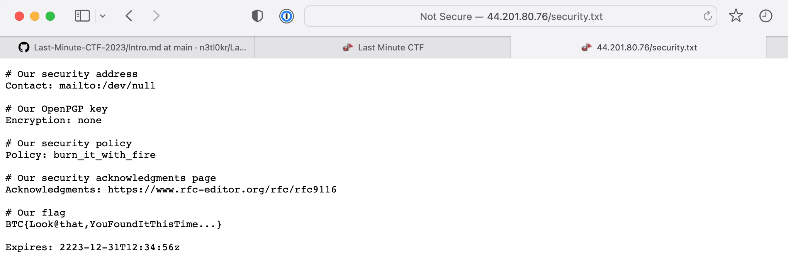

