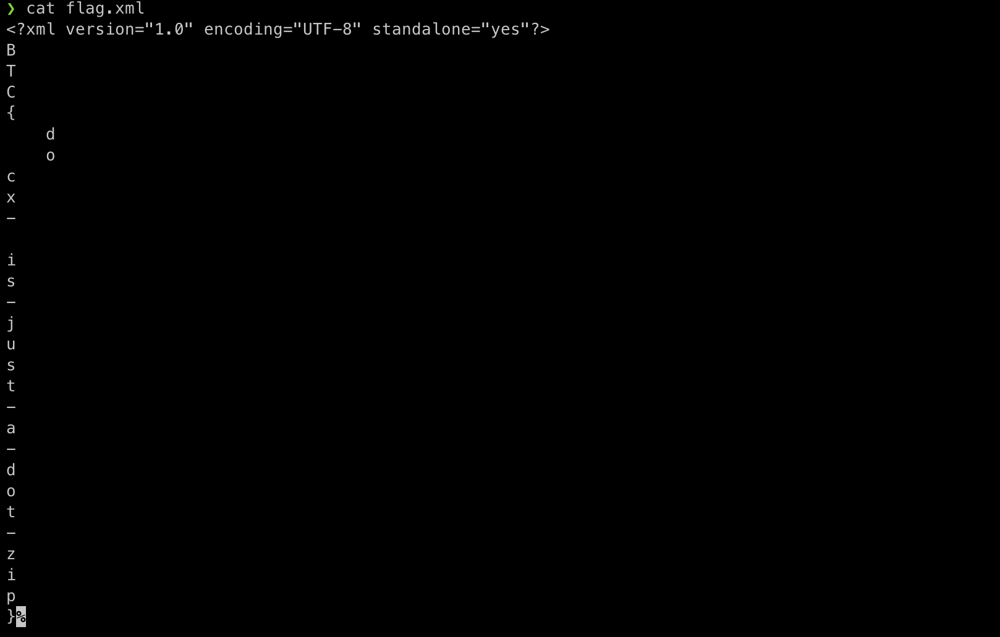

## Finders Keepers  
**Value** "10"  
**Clue** "Here's a file. It has files in it. Maybe it used to have more?"  
**Hint** ""  
**Flag** "BTC{bal33t3ed}"  

For this challenge, we are given a tarball containing what appears to be information about an EXT3 linux file system.  
1. Expanded the tarball with `tar -vxf chal.tgz`
2. Searched the contents of the file manually with `cat file.fs` and found the flag in plaintext as shown below. 

## Any docx in a Storm  
**Value** "15"  
**Clue** "When in a bind, sometimes you need to use their proprietary formats. But are they that proprietary?"  
**Hint** ""  
**Flag** "BTC{docx-is-just-a-dot-zip}"  

For this challenge, we are presented with a Microsoft Word document (.docx).  A Microsoft Office document is actually a collection of files bundled into an object which can be parsed by modifying the file as outlined. 
1. The file was first changed from a .docx file to a .zip file. 
2. The zip archive was then extracted where a file called `flag.xml` was located.  Within this file, the flag was presented in an odd format but was easily reconstituted. 

## There's More  
**Value** "30"  
**Clue** "There's a second deleted file hiding in there... Keep looking! This challenge uses the same file as Finders keepers"  
**Hint** ""  
**Flag** ""  

Unfortunately, this challenge was not completed.
